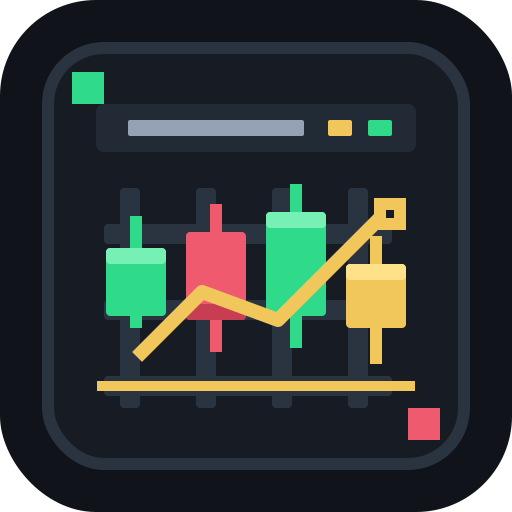

# Candlebar

[中文](README_CN.md) | English

<p align="center">
  
</p>

Candlebar is a small macOS menu bar app for watching crypto prices and checking a read-only Binance account snapshot without opening an exchange page.

It is built for quick glances: one default symbol stays in the menu bar, and the popover gives you a compact watchlist, spot estimate, futures overview, and basic account risk context.

## Features

- Live menu bar price for your default trading pair.
- Watchlist for Binance Spot, USD-M Futures, and COIN-M Futures symbols.
- Read-only Binance account overview for balances, positions, unrealized PnL, leverage, and liquidation references.
- Local-only settings and Keychain storage for API credentials.
- English and Chinese interface.
- App updates through Sparkle from GitHub Releases.

## Requirements

- macOS 14 or later.
- Network access to Binance market/account APIs.
- Optional Binance API key with read-only permission if you want account data.

## Install

1. Download the latest `Candlebar-v<version>.dmg` from GitHub Releases.
2. Open the `.dmg` and drag `Candlebar.app` into `Applications`.
3. Because this app is not signed with an Apple Developer ID yet, run this command once after installing:

```bash
xattr -cr /Applications/Candlebar.app
```

4. Open `Candlebar.app` from `Applications`.

macOS may still show a first-run warning for unsigned apps. If that happens, open System Settings and allow Candlebar from Privacy & Security.

## Binance API Key

Candlebar only needs read permission.

When creating a Binance API key, keep trading, withdrawal, transfer, and key-management permissions disabled. The key is stored in macOS Keychain and is used only for account snapshots inside the app.

You can also use Candlebar without an API key. Price watching works without account access.

## Updates

Use `Check for Updates...` from the app menu to check GitHub Releases through Sparkle.

The first install still uses the `.dmg` file. After that, Sparkle verifies release signatures and can guide the app update flow from inside Candlebar.

## Privacy

Candlebar does not run a backend service and does not send your Binance API key anywhere except Binance API requests from your Mac.

Diagnostics exports are redacted before display. Review any diagnostic text yourself before sharing it.

## Build From Source

```bash
script/build_and_run.sh --build-only
```

To create a local release `.dmg`:

```bash
script/release_dmg.sh
```

To generate the Sparkle appcast for a release:

```bash
script/generate_appcast.sh
```

To run the full local release check:

```bash
script/release_check.sh
```

The generated `.dmg` and `appcast.xml` are written to `dist/`. Upload both files to the matching GitHub Release.
