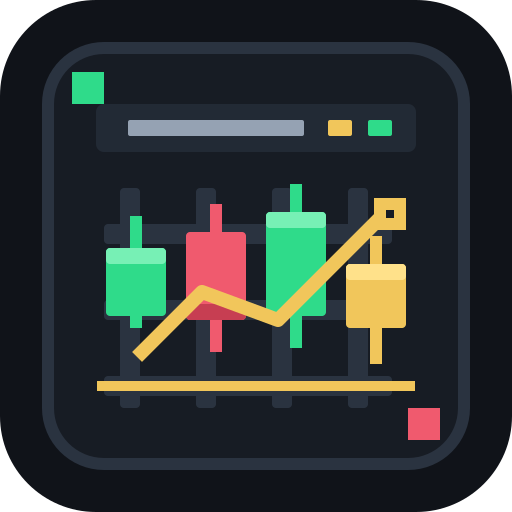

# Candlebar

[中文](README_CN.md) | English

<p align="center">
  
</p>

Candlebar is a small macOS menu bar app for watching crypto prices and checking a read-only Binance account snapshot without opening an exchange page.

It is built for quick glances: one default symbol stays in the menu bar, and the popover gives you a compact watchlist, spot estimate, futures overview, and basic account risk context.

## Features

- Live menu bar price for your default trading pair.
- Watchlist for Binance Spot, USD-M Futures, and COIN-M Futures symbols.
- Optional screen-edge sidebar with one row per watchlist symbol showing live price, daily change, and a trend sparkline, plus an account row; drag it to dock left or right, on any display.
- Read-only Binance account overview for balances, positions, unrealized PnL, leverage, and liquidation references.
- Local-only settings and Keychain storage for API credentials.
- English and Chinese interface.
- App updates through Sparkle from GitHub Releases.

## Requirements

- macOS 14 or later.
- Network access to Binance market/account APIs.
- Optional Binance API key with read-only permission if you want account data.

## Install

1. Download the latest `Candlebar-v<version>.dmg` from GitHub Releases.
2. Open the `.dmg` and drag `Candlebar.app` into `Applications`.
3. Because this app is not signed with an Apple Developer ID yet, run this command once after installing:

```bash
xattr -cr /Applications/Candlebar.app
```

4. Open `Candlebar.app` from `Applications`.

macOS may still show a first-run warning for unsigned apps. If that happens, open System Settings and allow Candlebar from Privacy & Security.

## Binance API Key

Candlebar only needs read permission.

When creating a Binance API key, keep trading, withdrawal, transfer, and key-management permissions disabled. The key is stored in macOS Keychain and is used only for account snapshots inside the app.

You can also use Candlebar without an API key. Price watching works without account access.

## Account totals and daily change

Total uses Binance's read-only [`GET /sapi/v1/asset/wallet/balance`](https://developers.binance.com/docs/wallet/asset/query-user-wallet-balance) with `quoteAsset=USDT`. It sums every wallet returned, including Spot (all assets), Funding, Earn, USD-M, COIN-M, margin and other wallets. Rows use the same Binance estimates; separate futures unrealized PnL is not added again. This is an estimate in **USDT**, not USD, and may differ from the website due to valuation timing or Binance API coverage.

Summary rows show balance and asset change from the displayed starting time, including deposits, withdrawals and transfers. Internal transfers cancel out in the total. Percentage is change divided by the positive baseline, multiplied by 100; it is unavailable for a zero/negative baseline. Position unrealized PnL remains in position details.

If the day's first complete wallet response arrives within **00:00:00–00:00:59 UTC** (08:00 in Singapore/China), it is an approximate midnight baseline and the column reads **Today (UTC)**. Otherwise, tracking begins with the first successful refresh and the column reads **Since Observation**, with the starting time explicitly shown. The first sample has zero change; subsequent refreshes compare against that same sample rather than resetting it. Since Observation is not a full-day change.

The current day's sample is stored locally across restarts, scoped to a hash of the API key; credentials are not stored with it. A new UTC day starts a new baseline using the same rules. Changed wallet coverage or unavailable data shows `--`. Binance's SPOT/MARGIN/FUTURES daily snapshots cannot reconstruct the complete wallet overview and are not substituted for it.

Wallet request failures and invalid amounts do not fall back to a partial account total. Hiding small wallet rows only affects the list, never the total.

## Updates

Use `Check for Updates...` from the app menu to check GitHub Releases through Sparkle.

The first install still uses the `.dmg` file. After that, Sparkle verifies release signatures and can guide the app update flow from inside Candlebar.

## Privacy

Candlebar does not run a backend service and does not send your Binance API key anywhere except Binance API requests from your Mac.

Diagnostics exports are redacted before display. Review any diagnostic text yourself before sharing it.

## Build From Source

```bash
script/build_and_run.sh --build-only
```

To create a local release `.dmg`:

```bash
script/release_dmg.sh
```

To generate the Sparkle appcast for a release:

```bash
script/generate_appcast.sh
```

To run the full local release check:

```bash
script/release_check.sh
```

The generated `.dmg` and `appcast.xml` are written to `dist/`. Upload both files to the matching GitHub Release.
